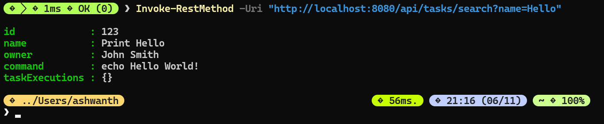
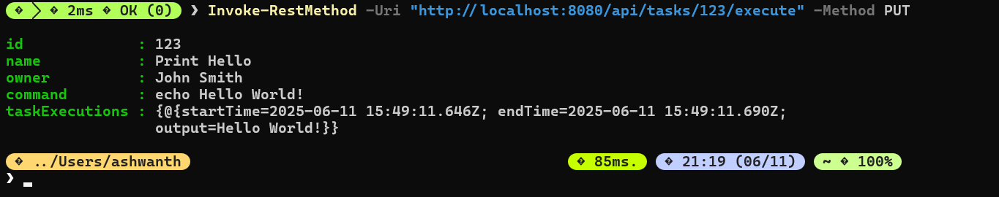

# Task Management REST API

A Spring Boot REST API application for managing and executing shell command tasks in Kubernetes pods. This application provides endpoints for creating, searching, deleting, and executing tasks with proper validation and MongoDB persistence.

## Table of Contents

- [Features](#features)
- [Prerequisites](#prerequisites)
- [Installation](#installation)
- [Configuration](#configuration)
- [Building the Application](#building-the-application)
- [Running the Application](#running-the-application)
- [API Documentation](#api-documentation)
- [Testing](#testing)
- [Deployment](#deployment)
- [Security](#security)

## Features

- ✅ **Task Management**: Create, read, update, delete tasks
- ✅ **Command Execution**: Execute shell commands and store results
- ✅ **Search Functionality**: Find tasks by name with partial matching
- ✅ **MongoDB Integration**: Persistent storage for tasks and execution history
- ✅ **Security Validation**: Command validation to prevent malicious code execution
- ✅ **Input Validation**: Comprehensive validation for all input fields
- ✅ **Error Handling**: Proper HTTP status codes and error messages
- ✅ **Execution History**: Track all task executions with timestamps and outputs

## Prerequisites

Before running this application, ensure you have the following installed:

- **Java 17** or higher
- **Maven 3.6+**
- **MongoDB 4.4+** (local installation or Docker)
- **Git** (for cloning the repository)

Optional tools for testing:

- **Postman** or **Insomnia** (for API testing)
- **curl** (command-line HTTP client)
- **Docker** (for containerized MongoDB)

## Installation

### 1. Clone the Repository

```bash
git clone <repository-url>
cd task-management-api
```

### 2. Set Up MongoDB

#### Option A: Local MongoDB Installation

Follow the [official MongoDB installation guide](https://docs.mongodb.com/manual/installation/) for your operating system.

#### Option B: Docker MongoDB (Recommended)

```bash
# Run MongoDB in Docker
docker run -d \
  --name mongodb \
  -p 27017:27017 \
  -v mongodb_data:/data/db \
  mongo:7.0

# Verify MongoDB is running
docker ps | grep mongodb
```

### 3. Verify Java and Maven Installation

```bash
# Check Java version
java --version

# Check Maven version
mvn --version
```

## Configuration

The application uses Spring Boot's configuration system. Main configuration is in `src/main/resources/application.yml`:

```yaml
spring:
  data:
    mongodb:
      uri: mongodb://localhost:27017/taskmanagement
  application:
    name: task-management-api
server:
  port: 8080
logging:
  level:
    com.example.taskmanagement: DEBUG
```

### Environment Variables

You can override configuration using environment variables:

```bash
export MONGODB_URI=mongodb://localhost:27017/taskmanagement
export SERVER_PORT=8080
export LOGGING_LEVEL=INFO
```

## Building the Application

### 1. Clean and Compile

```bash
# Clean previous builds and compile
mvn clean compile
```

### 2. Run Tests

```bash
# Run unit tests
mvn test
```

### 3. Package Application

```bash
# Create JAR file
mvn clean package

# Skip tests if needed
mvn clean package -DskipTests
```

The packaged JAR will be created in the `target/` directory as `task-management-api-1.0.0.jar`.

## Running the Application

### Method 1: Using Maven (Development)

```bash
# Run directly with Maven
mvn spring-boot:run
```

### Method 2: Using JAR File (Production)

```bash
# Build the JAR first
mvn clean package

# Run the JAR
java -jar target/task-management-api-1.0.0.jar
```

### Method 3: With Custom Configuration

```bash
# Run with custom port
java -jar target/task-management-api-1.0.0.jar --server.port=9090

# Run with custom MongoDB URI
java -jar target/task-management-api-1.0.0.jar --spring.data.mongodb.uri=mongodb://remote-host:27017/taskdb
```

### Verifying the Application

Once started, verify the application is running:

```bash
# Check if the application is responding
curl http://localhost:8080/api/tasks

# You should see an empty array [] if no tasks exist
```

## API Documentation

### Base URL

```
http://localhost:8080/api
```

### Endpoints

#### 1. Get All Tasks

```http
GET /api/tasks
```

**Response:**

```json
[
  {
    "id": "123",
    "name": "Print Hello",
    "owner": "John Smith",
    "command": "echo Hello World!",
    "taskExecutions": []
  }
]
```

#### 2. Get Single Task

```http
GET /api/tasks?id={taskId}
```

**Example:**

```bash
curl "http://localhost:8080/api/tasks?id=123"
```

#### 3. Create/Update Task

```http
PUT /api/tasks
Content-Type: application/json
```

**Request Body:**

```json
{
  "id": "123",
  "name": "Print Hello",
  "owner": "John Smith",
  "command": "echo Hello World!"
}
```

**Example:**

```bash
curl -X PUT http://localhost:8080/api/tasks \
  -H "Content-Type: application/json" \
  -d '{
    "id": "123",
    "name": "Print Hello",
    "owner": "John Smith",
    "command": "echo Hello World!"
  }'
```

#### 4. Search Tasks by Name

```http
GET /api/tasks/search?name={searchTerm}
```

**Example:**

```bash
curl "http://localhost:8080/api/tasks/search?name=Hello"
```

#### 5. Execute Task

```http
PUT /api/tasks/{taskId}/execute
```

**Example:**

```bash
curl -X PUT http://localhost:8080/api/tasks/123/execute
```

#### 6. Delete Task

```http
DELETE /api/tasks?id={taskId}
```

**Example:**

```bash
curl -X DELETE "http://localhost:8080/api/tasks?id=123"
```

### Response Codes

- `200 OK` - Success
- `400 Bad Request` - Invalid input or unsafe command
- `404 Not Found` - Task not found
- `500 Internal Server Error` - Server error

## Testing

### Manual Testing with curl

#### Create a Test Task

```bash
curl -X PUT http://localhost:8080/api/tasks \
  -H "Content-Type: application/json" \
  -d '{
    "id": "test-001",
    "name": "List Files",
    "owner": "Developer",
    "command": "ls -la"
  }'
```

#### Execute the Task

```bash
curl -X PUT http://localhost:8080/api/tasks/test-001/execute
```

#### View Task with Execution History

```bash
curl "http://localhost:8080/api/tasks?id=test-001"
```

### Testing with Postman

Below are screenshots demonstrating all API endpoints tested with Postman:

#### 1. Create Task

*Creating a new task with valid data*

#### 2. Get All Tasks

*Retrieving all tasks from the database*

#### 3. Get Single Task

*Retrieving a specific task by ID*

#### 4. Get Invalid Task

*Attempting to retrieve a non-existent task (404 response)*

#### 5. Search Task by Name

*Searching for tasks containing specific text in name*

#### 6. Search Invalid Task

*Searching for non-existent task name (404 response)*

#### 7. Execute a Task

*Executing a task and viewing the execution results*

#### 8. Delete Task by ID

*Deleting a task and receiving confirmation*

### Load Testing

For load testing, you can use tools like Apache JMeter or Artillery:

```bash
# Example with Apache Bench (ab)
ab -n 100 -c 10 http://localhost:8080/api/tasks
```

## Deployment

### Local Deployment

The application is ready to run locally following the installation and running instructions above.

### Docker Deployment

#### 1. Create Dockerfile

```dockerfile
FROM openjdk:17-jdk-slim

WORKDIR /app

COPY target/task-management-api-1.0.0.jar app.jar

EXPOSE 8080

ENTRYPOINT ["java", "-jar", "app.jar"]
```

#### 2. Build Docker Image

```bash
# Build the application first
mvn clean package

# Build Docker image
docker build -t task-management-api:1.0.0 .
```

#### 3. Run with Docker Compose

Create `docker-compose.yml`:

```yaml
version: "3.8"
services:
  mongodb:
    image: mongo:7.0
    ports:
      - "27017:27017"
    volumes:
      - mongodb_data:/data/db

  task-management-api:
    image: task-management-api:1.0.0
    ports:
      - "8080:8080"
    environment:
      - SPRING_DATA_MONGODB_URI=mongodb://mongodb:27017/taskmanagement
    depends_on:
      - mongodb

volumes:
  mongodb_data:
```

```bash
# Start services
docker-compose up -d

# View logs
docker-compose logs -f task-management-api
```

### Kubernetes Deployment

#### 1. Create ConfigMap

```yaml
apiVersion: v1
kind: ConfigMap
metadata:
  name: task-management-config
data:
  application.yml: |
    spring:
      data:
        mongodb:
          uri: mongodb://mongodb-service:27017/taskmanagement
    server:
      port: 8080
```

#### 2. Create Deployment

```yaml
apiVersion: apps/v1
kind: Deployment
metadata:
  name: task-management-api
spec:
  replicas: 3
  selector:
    matchLabels:
      app: task-management-api
  template:
    metadata:
      labels:
        app: task-management-api
    spec:
      containers:
        - name: task-management-api
          image: task-management-api:1.0.0
          ports:
            - containerPort: 8080
          volumeMounts:
            - name: config
              mountPath: /app/config
      volumes:
        - name: config
          configMap:
            name: task-management-config
```

#### 3. Create Service

```yaml
apiVersion: v1
kind: Service
metadata:
  name: task-management-service
spec:
  selector:
    app: task-management-api
  ports:
    - port: 80
      targetPort: 8080
  type: LoadBalancer
```

```bash
# Apply configurations
kubectl apply -f configmap.yaml
kubectl apply -f deployment.yaml
kubectl apply -f service.yaml
```

## Security

### Command Validation

The application includes built-in security features:

- **Dangerous Command Detection**: Blocks commands like `rm`, `sudo`, `chmod`
- **Shell Operator Prevention**: Prevents use of `&&`, `||`, `;`, `|`, `>`
- **Input Validation**: Validates all required fields

### Safe Commands Examples

✅ **Allowed:**

- `echo Hello World`
- `ls -la`
- `date`
- `pwd`
- `whoami`

❌ **Blocked:**

- `rm -rf /`
- `sudo apt update`
- `echo test && rm file`
- `ls | grep secret`

### Production Security Recommendations

1. **Authentication**: Implement JWT or OAuth2
2. **Authorization**: Role-based access control
3. **Rate Limiting**: Prevent API abuse
4. **HTTPS**: Use TLS in production
5. **Container Security**: Run in isolated containers
6. **Network Policies**: Restrict network access
7. **Monitoring**: Implement logging and alerting

## Troubleshooting

### Common Issues

#### 1. MongoDB Connection Failed

**Error:** `com.mongodb.MongoSocketOpenException`

**Solution:**

```bash
# Check if MongoDB is running
docker ps | grep mongo

# Or for local installation
sudo systemctl status mongod

# Restart MongoDB
docker restart mongodb
```

#### 2. Port Already in Use

**Error:** `Port 8080 was already in use`

**Solution:**

```bash
# Find process using port 8080
lsof -i :8080

# Kill the process
kill -9 <PID>

# Or run on different port
java -jar target/task-management-api-1.0.0.jar --server.port=9090
```

#### 3. Command Execution Fails

**Error:** Task execution returns error output

**Solution:**

- Verify the command syntax
- Check if the command is in the blocked list
- Ensure proper permissions for command execution

#### 4. Maven Build Fails

**Error:** `Could not resolve dependencies`

**Solution:**

```bash
# Clear Maven cache
mvn dependency:purge-local-repository

# Update dependencies
mvn clean install -U
```

### Debugging

#### Enable Debug Logging

Add to `application.yml`:

```yaml
logging:
  level:
    com.example.taskmanagement: DEBUG
    org.springframework.data.mongodb: DEBUG
```

#### View Application Logs

```bash
# If running with Maven
mvn spring-boot:run

# If running JAR with logging
java -jar target/task-management-api-1.0.0.jar --logging.level.com.example.taskmanagement=DEBUG
```

### Health Checks

#### Application Health

```bash
# Check if application is responding
curl http://localhost:8080/api/tasks

# Check MongoDB connection
curl "http://localhost:8080/api/tasks" -v
```

#### Database Health

```bash
# Connect to MongoDB
docker exec -it mongodb mongosh

# Check database
use taskmanagement
db.tasks.find()
```
